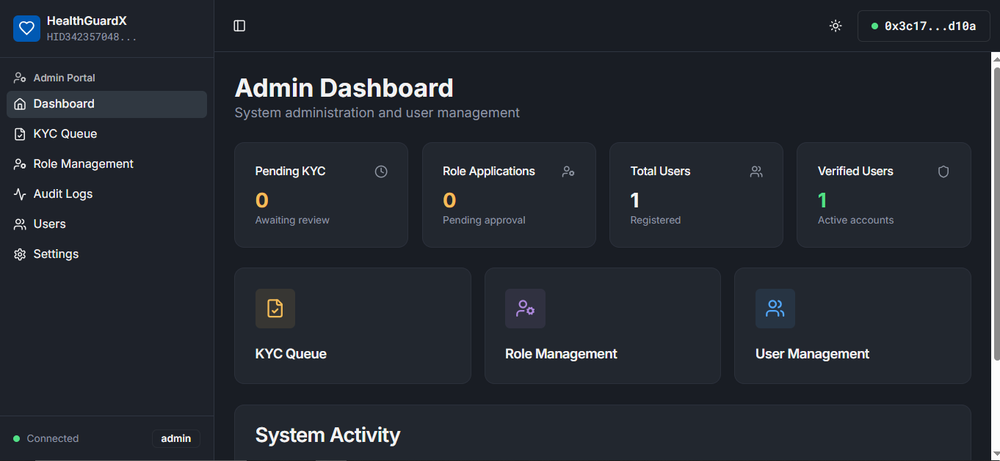

# HealthGuardX - Decentralized Health Identity System

## Overview

HealthGuardX is a blockchain-integrated system designed to provide secure, patient-owned medical records and streamline insurance claim management. It features emergency QR access, role-based dashboards for various healthcare stakeholders (patients, doctors, hospitals, emergency responders, insurance providers, administrators), and blockchain-verified insurance claims. The project operates on the BlockDAG ecosystem with BDAG as the primary currency. The project aims to enhance data security, improve accessibility for authorized personnel, and provide a robust platform for managing health identities and claims.

# HealthGuardX - Comprehensive System Documentation

## Table of Contents
1. [System Overview](#system-overview)
2. [System Architecture](#system-architecture)
3. [User Roles and Features](#user-roles-and-features)
4. [Workflows and User Journeys](#workflows-and-user-journeys)
5. [Security and Data Protection](#security-and-data-protection)
6. [Problems Solved](#problems-solved)
7. [Technical Implementation](#technical-implementation)
8. [Getting Started Guide](#getting-started-guide)

---

## System Overview

### What is HealthGuardX?

HealthGuardX is a blockchain-integrated decentralized health identity system that puts patients in control of their medical records. Think of it as a secure digital vault for your health information, where you decide who can access your data and when.

### Key Value Propositions

- **Patient-Owned Data**: You own your medical records, not the hospital or doctor
- **Emergency Access**: First responders can instantly access critical health information via QR codes
- **Blockchain Verified**: All transactions and claims are verified and tamper-proof
- **Universal Accessibility**: Access your health records from anywhere, anytime
- **Streamlined Insurance**: Automated claim processing reduces paperwork and delays

### Built for African Healthcare Realities

The system is specifically designed to address challenges in African healthcare systems:
- Works with limited internet connectivity (QR codes work offline)
- Affordable subscription model (2 BDAG for testing)
- Multi-stakeholder support (hospitals, clinics, insurance providers)
- Emergency response capabilities for areas with limited infrastructure

---

## System Architecture

### Technology Stack Overview

HealthGuardX uses modern web technologies combined with blockchain principles to create a secure, scalable healthcare platform.

#### Frontend Layer
- **Framework**: React 18 with TypeScript for type safety
- **UI Components**: Shadcn/ui (built on Radix UI) for accessible, beautiful interfaces
- **Styling**: Tailwind CSS for responsive design that works on all devices
- **State Management**: TanStack Query (React Query) for efficient data fetching and caching
- **Routing**: Wouter for fast, lightweight navigation

#### Backend Layer
- **Server**: Express.js with TypeScript for robust API development
- **Database**: PostgreSQL (Neon serverless) for reliable, scalable data storage
- **ORM**: Drizzle ORM for type-safe database queries
- **Authentication**: Web3 wallet-based (MetaMask) - no passwords to remember or lose

### Blockchain & IPFS Integration

- **Real Smart Contract Integration**: Connected to deployed BlockDAG smart contracts:
  - HealthGuardXUsers: `0x7ddd2eb4ece89825096367fd6f72623996ad1a55`
  - HealthGuardXMedical: `0x33b7b70a1a20233b441527a7cd5b43c791d78860`
  - HealthGuardXTreatments: `0x865f4b7835cffad383d33211033ea3b747010cd8`
  - HealthGuardXInsurance: `0xeaa1afa47136f28828464a69e21046da8706c635`
  - HealthGuardXPayments: `0x479a9cd7bee5a12333ae3f44ad7b960aaf479278ffcb733cf3f4f80d00f465ae`

- **Pinata IPFS Storage**: Replaced simulated IPFS with real Pinata cloud storage:
  - All medical records now uploaded to IPFS with real CIDs
  - KYC documents stored on IPFS for immutable verification
  - Treatment logs and patient data permanently stored on decentralized storage
  - File integrity verified with SHA-256 hashes
  - Automatic fallback to simulated storage if IPFS is unavailable

- **Blockchain Service Layer**: Created comprehensive blockchain integration infrastructure:
  - `server/blockchain.ts`: Smart contract read-only service for querying blockchain state
  - `server/blockchain-config.ts`: Contract addresses and network configuration  
  - `client/src/lib/blockchain.ts`: **Frontend blockchain client for user transactions** (this is where actual contract interactions happen)
  - Following Web3 best practices: Users sign transactions with their MetaMask wallets on the frontend
  - Server only reads blockchain state and validates results - never stores private keys
  - Supports user registration, KYC submission, medical records, treatments, insurance, and payments via frontend wallet signing

- **IPFS Service Module**: Built complete Pinata integration:
  - `server/ipfs.ts`: Handles file and JSON uploads to Pinata
  - Supports both file upload (with base64 encoding) and JSON data upload
  - Returns CID, hash, and gateway URL for each upload
  - Metadata support for organizing uploaded content

- **Updated Routes for Real Storage**: Modified all backend routes to use actual IPFS:
  - KYC document submission uploads to IPFS
  - Medical record uploads store files on IPFS with permanent CIDs
  - Treatment logs uploaded as JSON to IPFS for immutable audit trail
  - All uploads include metadata for tracking and organization

### Data Flow Architecture

```
User (Web3 Wallet) → Frontend → API Server → Database
                                    ↓
                            Audit Logs / Blockchain Layer
```

1. **User connects wallet** (MetaMask on desktop/mobile)
2. **Signs authentication message** (proves wallet ownership)
3. **Accesses role-based dashboard** (patient, doctor, hospital, etc.)
4. **Performs actions** (upload records, request access, submit claims)
5. **All actions are logged** (immutable audit trail)

### Security Architecture

#### Multiple Layers of Protection

1. **Wallet-Based Authentication**
   - No passwords to steal or forget
   - Cryptographic signatures verify every action
   - Wallet address = your unique identity

2. **Role-Based Access Control (RBAC)**
   - Six distinct roles with specific permissions
   - Users only see data relevant to their role
   - Admins can't access patient records without permission

3. **Encryption**
   - Medical records encrypted client-side before upload
   - SHA-256 hashing for file integrity verification
   - Simulated IPFS CIDs for immutable storage references

4. **Access Control**
   - Granular permissions (read/write/emergency)
   - Time-based expiration on access grants
   - Patients can revoke access anytime

5. **Audit Trails**
   - Every action logged with timestamp and user
   - Immutable records of all transactions
   - Compliance-ready audit reports

---

## User Roles and Features

HealthGuardX supports six distinct user roles, each with specific capabilities designed for their needs.

### 1. Patient Role

**Who**: Individuals seeking healthcare services and managing their medical records.

**Primary Capabilities**:

1. **Health Profile Management**
   - Create and update personal health information
   - Blood type, allergies, chronic conditions
   - Current medications and emergency contacts
   - Height, weight, organ donor status

2. **Medical Records Management**
   - Upload medical documents (lab reports, prescriptions, imaging, diagnoses)
   - Files encrypted before storage for privacy
   - Categorize records by type
   - Mark records for emergency access

3. **Access Control**
   - View all access requests from doctors/hospitals/emergency responders
   - Grant or deny access requests
   - Set expiration dates on access grants
   - Revoke access at any time
   - See who has viewed your records

4. **Emergency QR Code**
   - Generate scannable QR code with critical health info
   - Blood type, allergies, emergency contact visible to first responders
   - Download and save QR code for wallet/phone
   - Track how many times QR code has been scanned

5. **Insurance Management**
   - Connect with insurance providers
   - Pay monthly premiums in BDAG
   - View insurance claims status
   - Approve or reject claims submitted by hospitals

6. **Consultations**
   - Request consultations with doctors
   - Real-time chat with healthcare providers
   - View consultation history
   - Pay consultation fees

7. **Role Applications**
   - Apply to become a doctor, hospital, or insurance provider
   - Submit required documents for verification
   - Track application status

8. **Audit Trail**
   - View complete history of actions on your account
   - See who accessed your records and when
   - Track all transactions and payments

**Dashboard View**: Shows quick stats on records uploaded, pending access requests, active insurance claims, and recent activity.

---

### 2. Doctor Role

**Who**: Licensed medical professionals providing healthcare services.

**Primary Capabilities**:

1. **Patient Search**
   - Search for patients by UID, username, or wallet address
   - View patient basic information
   - Request access to patient records

2. **Access Management**
   - Send access requests to patients
   - Provide reason for access request
   - View pending, granted, and revoked access
   - Access expires automatically based on patient settings

3. **Medical Records Access**
   - View patient medical history (with granted access)
   - Download medical documents
   - Review treatment history from other doctors
   - Access emergency-flagged records

4. **Treatment Logging**
   - Create signed treatment records
   - Record diagnosis, treatment plan, prescriptions
   - Attach supporting documents (up to 5 files, max 10MB each)
   - Link treatment to hospital admission (if applicable)
   - Digital signature verification for authenticity

5. **Patient Assignment**
   - View assigned patients from hospital
   - Manage patient roster
   - Track active vs. discharged patients

6. **Consultations**
   - Accept or reject consultation requests
   - Real-time chat with patients
   - Complete consultations and close sessions
   - Receive consultation fees (2% platform fee)

7. **QR Code Scanner**
   - Scan patient QR codes for emergency information
   - Request access after QR scan
   - All scans logged in audit trail

**Dashboard View**: Shows assigned patients, pending access requests, active access grants, total treatments logged, and recent consultations.

---

### 3. Hospital Role

**Who**: Healthcare institutions (hospitals, clinics, medical centers).

**Primary Capabilities**:

1. **Patient Management**
   - Admit patients to hospital
   - Assign patients to doctors
   - Discharge patients
   - View admission history
   - Track treated patients count

2. **Access Requests**
   - Request access to patient records
   - Provide medical justification
   - Emergency access requests (with proof)
   - View granted access list

3. **Treatment Records**
   - View all treatments performed at the facility
   - Filter by patient or doctor
   - Access treatment files and documents
   - Generate reports

4. **Invoice Management**
   - Create invoices for patient treatments
   - Track invoice payment status
   - Receive payments in BDAG (2% platform fee)
   - View revenue from paid invoices

5. **Insurance Claims**
   - Submit claims to insurance providers
   - Attach treatment records and invoices
   - Track claim status (pending, approved, rejected, paid)
   - Receive claim payments

6. **Subscription Management**
   - Annual subscription: 2 BDAG (testing price)
   - Pay subscription via MetaMask
   - Track subscription expiry
   - Renew subscription

7. **Hospital Directory**
   - Manage hospital profile
   - Update hospital information
   - View hospital statistics

8. **QR Code Scanner**
   - Scan patient QR codes at admission
   - Emergency access for unconscious patients
   - Logged and audited scans

**Dashboard View**: Shows pending claims, approved claims, revenue from paid claims, treated patients, total treatments, and recent activity.

---

### 4. Emergency Responder Role

**Who**: First responders, paramedics, emergency medical technicians.

**Primary Capabilities**:

1. **Emergency QR Scanner**
   - Instant access to critical patient information
   - No prior access request needed
   - Scan QR code at emergency scene
   - View blood type, allergies, chronic conditions, medications
   - Emergency contact information

2. **Patient Records Access**
   - Request full access after emergency stabilization
   - View granted access list
   - Access medical history for informed treatment

3. **Emergency History**
   - Track all emergency scans performed
   - View scan timestamps and patient details
   - Audit trail of emergency responses

4. **Patient List**
   - See patients who have granted access
   - Quick access to patient profiles
   - View emergency flags on records

**Dashboard View**: Shows total patients scanned, granted access count, emergency scans today, and scan history.

**Special Features**:
- Emergency access is logged and flagged
- Hospitals are notified of emergency access requests
- Proof of emergency can be uploaded (photo, details)
- Designed for time-critical situations

---

### 5. Insurance Provider Role

**Who**: Health insurance companies and organizations.

**Primary Capabilities**:

1. **Policy Management**
   - Create insurance policies for patients
   - Set monthly premium amounts
   - Define coverage limits
   - Specify coverage types (emergency, outpatient, inpatient, surgery)
   - Manage policy offerings

2. **Patient Connections**
   - Review connection requests from patients
   - Approve or reject connection applications
   - View connected patients list
   - Track patient billing status

3. **Premium Collection**
   - Automated monthly premium billing
   - Track premium payment status
   - Handle missed payments
   - Disconnect patients after multiple missed payments

4. **Claims Processing**
   - Review claims submitted by hospitals
   - View patient, hospital, and treatment details
   - Approve claims (set approved amount)
   - Reject claims (provide rejection reason)
   - Pay approved claims to hospitals

5. **Analytics Dashboard**
   - Total connected patients
   - Premium revenue collected
   - Claims processed statistics
   - Pending vs. paid claims ratio
   - Financial overview

6. **Subscription Management**
   - Annual subscription: 2 BDAG (testing price)
   - Pay subscription via MetaMask
   - Track subscription expiry

**Dashboard View**: Shows connected patients, pending claims, total claims processed, premium revenue, and recent claim activity.

**Payment Flows**:
- Patients → Insurance Provider (Monthly Premiums)
- Insurance Provider → Hospital (Claim Payments, 2% platform fee)

---

### 6. Admin Role

**Who**: System administrators managing the HealthGuardX platform.

**Primary Capabilities**:

1. **KYC Verification**
   - Review KYC submissions from all users
   - Verify identity documents
   - Approve or reject KYC applications
   - Provide rejection reasons
   - Track verification queue

2. **Role Management**
   - Review role applications (doctor, hospital, emergency responder, insurance provider)
   - Approve or reject role changes
   - Verify professional licenses
   - Verify institutional credentials

3. **User Management**
   - View all system users
   - Filter by role and status
   - Monitor user activity
   - Suspend accounts if needed
   - View user statistics

4. **Audit Logs**
   - Complete system audit trail
   - Filter by user, action, date
   - Export audit reports
   - Compliance monitoring
   - Security oversight

5. **System Settings**
   - Configure platform parameters
   - Manage subscription pricing
   - Set platform fee percentages
   - Update system policies

**Dashboard View**: Shows pending KYC count, pending role applications, total users, verified users, and system activity.

**Real-Time Updates**: Admin dashboard auto-refreshes every 3 seconds to show latest KYC and role applications.

---

## Workflows and User Journeys

### Workflow 1: Patient Onboarding and Record Upload

**Scenario**: A new patient wants to join HealthGuardX and upload their medical records.

**Steps**:

1. **Connect Wallet**
   - Patient visits HealthGuardX website
   - Clicks "Connect Wallet"
   - MetaMask opens (browser extension on desktop, or deep link to mobile app)
   - Signs authentication message
   - Account created automatically with unique Health ID (UID)

2. **Complete KYC**
   - Navigate to Profile settings
   - Fill in personal information:
     - Full name, date of birth, national ID
     - Phone number, address
     - Document type and number
     - Upload ID document
     - Select affiliated hospital (optional)
   - Submit KYC for verification
   - Wait for admin approval (status shows "Pending")

3. **After KYC Approval**
   - Status changes to "Verified"
   - Full access to patient features unlocked

4. **Create Health Profile**
   - Navigate to Profile
   - Enter health information:
     - Blood type, allergies, chronic conditions
     - Current medications
     - Emergency contact and phone
     - Height, weight, organ donor preference
   - Save profile

5. **Upload Medical Records**
   - Navigate to Records section
   - Click "Upload New Record"
   - Fill in details:
     - Title and description
     - Record type (lab report, prescription, imaging, etc.)
     - Select file (PDF, JPG, PNG, DOC, DOCX)
     - Mark for emergency access (optional)
   - Submit - file is encrypted and uploaded
   - Receive unique record ID and verification hash

6. **Generate Emergency QR Code**
   - Navigate to QR Code section
   - Click "Generate QR Code"
   - QR code created with critical health info:
     - Blood type, allergies, chronic conditions
     - Current medications
     - Emergency contact
   - Download QR code as SVG
   - Print and carry in wallet

**Outcome**: Patient now has secure, encrypted medical records accessible from anywhere, plus an emergency QR code for first responders.

---

### Workflow 2: Doctor Accessing Patient Records

**Scenario**: A doctor needs to access a patient's medical history to provide treatment.

**Steps**:

1. **Doctor Onboarding** (One-time)
   - Connect wallet, complete KYC
   - Submit professional license and hospital affiliation
   - Apply for "Doctor" role
   - Wait for admin approval
   - Pay any required subscription fees

2. **Search for Patient**
   - Doctor logs into doctor dashboard
   - Navigate to "Search Patients"
   - Enter patient UID, username, or wallet address
   - View patient basic information

3. **Request Access**
   - Click "Request Access" on patient profile
   - Select access type (Full or Emergency Only)
   - Provide reason for access request:
     - "Pre-surgical consultation"
     - "Follow-up treatment"
     - "Emergency care"
   - Submit request

4. **Patient Reviews Request**
   - Patient receives notification (real-time update)
   - Patient views doctor's details and reason
   - Patient grants access (can set expiration date)
   - OR patient denies access (provide reason)

5. **Access Granted**
   - Doctor receives notification
   - Navigate to "Patients" section
   - View patient in granted access list
   - Click to view full medical history

6. **View Medical Records**
   - See all patient records (unless emergency-only access)
   - Download documents
   - Review treatment history
   - View health profile details

7. **Create Treatment Log**
   - After treating patient, navigate to "Treatments"
   - Click "Create Treatment Log"
   - Select patient
   - Enter diagnosis and treatment plan
   - Add prescription details
   - Attach supporting files (up to 5 files, 10MB max)
   - Submit - receives digital signature
   - Treatment log saved with blockchain verification

**Outcome**: Doctor has secure, time-limited access to patient records, and creates verifiable treatment records.

---

### Workflow 3: Emergency QR Code Scan

**Scenario**: A patient is unconscious in an emergency, and a paramedic needs critical health information.

**Steps**:

1. **Emergency Responder Setup** (One-time)
   - Connect wallet, complete KYC
   - Submit certification and employer details
   - Apply for "Emergency Responder" role
   - Wait for admin approval

2. **At Emergency Scene**
   - Paramedic arrives at scene
   - Patient is unconscious or unable to communicate
   - Paramedic finds patient's QR code (wallet, phone, medical ID bracelet)

3. **Scan QR Code**
   - Open HealthGuardX app on mobile device
   - Navigate to "Emergency Scanner"
   - Tap "Start Camera" or "Upload QR Image"
   - Scan patient's QR code

4. **Instant Information Access**
   - QR code verified
   - Critical information displayed immediately:
     - Blood type: O+
     - Allergies: Penicillin, Shellfish
     - Chronic conditions: Type 2 Diabetes, Hypertension
     - Current medications: Metformin 500mg, Lisinopril 10mg
     - Emergency contact: John Doe (555-1234)
   - Scan logged in system

5. **Informed Emergency Care**
   - Paramedic avoids allergenic medications
   - Adjusts treatment for chronic conditions
   - Contacts emergency contact
   - Transports to hospital with full information

6. **Hospital Admission**
   - Hospital receives patient
   - Hospital scans QR code again
   - Requests full access to records (with emergency proof)
   - Patient's affiliated hospital auto-notified

7. **Post-Emergency Access**
   - If patient stabilizes and can consent
   - Patient reviews and approves/denies full access request
   - If patient remains incapacitated
   - Hospital uses emergency access for continued care
   - All emergency access logged and audited

**Outcome**: Life-saving information accessed instantly without delays, proper documentation for all emergency actions.

---

### Workflow 4: Insurance Claim Processing

**Scenario**: A patient receives treatment at a hospital, and the hospital submits an insurance claim.

**Steps**:

1. **Patient Has Active Insurance**
   - Patient previously connected with insurance provider
   - Monthly premiums paid automatically
   - Coverage active

2. **Hospital Treats Patient**
   - Patient admitted to hospital
   - Hospital requests access to records
   - Patient grants access
   - Doctor creates treatment logs
   - Hospital provides care

3. **Hospital Creates Invoice**
   - Navigate to "Invoices"
   - Create invoice for patient treatment
   - Enter treatment details and amount
   - Submit invoice

4. **Hospital Submits Claim**
   - Navigate to "Claims"
   - Click "Submit New Claim"
   - Select patient and their insurance connection
   - Enter claim details:
     - Claim type (emergency, outpatient, inpatient, surgery)
     - Treatment description
     - Claim amount: 500 BDAG
     - Attach treatment logs
     - Attach invoice
   - Submit claim with digital signature

5. **Patient Reviews Claim**
   - Patient receives notification
   - Reviews claim details from hospital
   - Checks accuracy of treatment and amount
   - Approves claim (or rejects with reason)

6. **Insurance Provider Reviews**
   - Claim appears in insurance provider's dashboard
   - Provider reviews:
     - Patient coverage status
     - Treatment details and medical records
     - Invoice and claim amount
     - Coverage type and limits
   - Makes decision:
     - Approve (set approved amount, may be less than claimed)
     - Reject (provide detailed reason)

7. **Claim Approved**
   - Status changes to "Approved"
   - Approved amount: 450 BDAG (90% coverage)

8. **Payment Processing**
   - Insurance provider pays claim via MetaMask
   - Payment amount: 450 BDAG
   - Platform fee deducted (2%): 9 BDAG
   - Hospital receives: 441 BDAG
   - Transaction verified and logged

9. **Confirmation**
   - Hospital receives payment notification
   - Claim status changes to "Paid"
   - Patient sees final claim status
   - All parties have transaction records

**Outcome**: Streamlined claim process with transparency, automated verification, and fast payment.

---

### Workflow 5: Admin KYC and Role Verification

**Scenario**: Administrator reviews and approves user applications to maintain system integrity.

**Steps**:

1. **User Submits KYC**
   - Patient submits KYC with identity documents
   - KYC enters admin queue with "Pending" status

2. **Admin Reviews KYC Queue**
   - Admin logs into admin dashboard
   - Dashboard shows: "5 Pending KYC" (auto-refreshes every 3 seconds)
   - Navigate to "KYC Verification"
   - View list of pending submissions

3. **Review Individual KYC**
   - Click on KYC submission
   - Review details:
     - Full name, date of birth, national ID
     - Uploaded document image
     - Phone number, address
     - Requested role (if applicable)
   - Verify document authenticity
   - Check for completeness

4. **Approve or Reject**
   - If valid: Click "Approve"
     - User status changes to "Verified"
     - User gains full access to features
   - If invalid: Click "Reject"
     - Provide clear rejection reason
     - User can resubmit with corrections

5. **Role Application Review**
   - User applies for doctor role
   - Submits professional license
   - Pays 2 BDAG subscription fee
   - Application enters role queue

6. **Verify Professional Credentials**
   - Admin navigates to "Role Applications"
   - Reviews doctor application:
     - Professional license number
     - Hospital affiliation
     - Supporting documents
   - Verifies license with medical board (external)

7. **Approve Role**
   - Click "Approve Role"
   - User role changes from "Patient" to "Doctor"
   - User gains doctor dashboard and features

8. **Monitor System**
   - View "Audit Logs" for all system activity
   - Track user actions and transactions
   - Identify suspicious patterns
   - Generate compliance reports

**Outcome**: Verified users ensure system integrity, fraudulent users prevented, professional standards maintained.

---

## Security and Data Protection

### Authentication Security

**Wallet-Based Authentication**:
- No passwords to remember, steal, or leak
- Cryptographic signatures prove wallet ownership
- Each action signed by user's private key
- Signatures verified before processing

**Benefits**:
- Phishing-resistant (can't steal what doesn't exist)
- No password reset vulnerabilities
- No credential stuffing attacks
- User maintains complete control

### Data Encryption

**Client-Side Encryption**:
- Medical records encrypted before leaving user's device
- AES-256 encryption standard
- Encryption keys never stored in plain text
- Only authorized users can decrypt

**File Integrity**:
- SHA-256 hashing for all uploaded files
- Hash verified on retrieval to detect tampering
- Simulated IPFS CIDs for immutable storage references
- Blockchain-style verification

### Access Control Security

**Granular Permissions**:
- Read-only vs. Full access
- Emergency-only access
- Time-based expiration
- Revocable at any time

**Audit Trail**:
- Every access logged with:
  - Who accessed
  - What was accessed
  - When it was accessed
  - Why (reason provided)
- Immutable audit logs
- Cannot be altered or deleted

### Role-Based Security

**Principle of Least Privilege**:
- Users only see data relevant to their role
- Patients can't see doctor functions
- Doctors can't access admin functions
- Insurance providers can't see unrelated claims

**Verification Requirements**:
- KYC required for all users
- Professional licenses verified for doctors
- Institutional credentials for hospitals
- Certification for emergency responders

### Network Security

**HTTPS Only**:
- All communications encrypted in transit
- SSL/TLS certificates
- Secure WebSocket connections for real-time chat

**Content Security Policy**:
- Prevents XSS attacks
- Restricts resource loading
- Allows legitimate functionality (blob URLs for documents)

### Payment Security

**Blockchain Transactions**:
- All payments via MetaMask
- Transaction verification
- 2% platform fee deducted automatically
- Immutable payment records

**Subscription Verification**:
- Active subscription required for institutional users
- Subscription expiry enforced
- Payment history tracked

### Compliance and Privacy

**GDPR-Ready**:
- Patient owns their data
- Right to access all information
- Right to revoke access
- Right to data portability

**HIPAA-Aligned**:
- Audit trails for all access
- Encryption at rest and in transit
- Access controls and authentication
- Emergency access protocols

**Blockchain Verification**:
- Simulated smart contract layer
- Transaction hashing
- Signature verification
- Ready for on-chain deployment

---

## Problems Solved

### Problem 1: Fragmented Medical Records

**The Problem**:
- Patients visit multiple hospitals and doctors
- Each maintains separate record systems
- No communication between systems
- Patients can't access their complete medical history
- Critical information unavailable during emergencies

**HealthGuardX Solution**:
- Centralized patient-owned record system
- Upload records from any healthcare provider
- Access records from anywhere with internet
- Emergency QR codes for offline access
- Complete medical history in one place

**Impact**:
- Better treatment decisions with complete information
- Reduced duplicate tests and procedures
- Faster diagnoses
- Improved continuity of care

---

### Problem 2: Emergency Care Delays

**The Problem**:
- Unconscious or non-communicative patients
- No access to critical health information
- Allergies unknown - risk of fatal reactions
- Current medications unknown - risk of drug interactions
- Chronic conditions not apparent
- Valuable time wasted gathering information

**HealthGuardX Solution**:
- Emergency QR codes with critical information
- Instant access by scanning (no login required)
- Blood type, allergies, conditions, medications
- Emergency contact information
- Works offline (no internet needed)

**Impact**:
- Life-saving information in seconds
- Avoidance of allergenic medications
- Appropriate treatment for chronic conditions
- Contact family immediately
- Better emergency outcomes

---

### Problem 3: Insurance Claim Delays

**The Problem**:
- Manual claim submission with paperwork
- Long processing times (weeks to months)
- Lack of transparency in claim status
- Frequent rejections due to incomplete documentation
- Delayed payments to hospitals
- Patients caught in the middle

**HealthGuardX Solution**:
- Digital claim submission with all documentation
- Automated verification of treatment records
- Real-time claim status tracking
- Patient approval step for transparency
- Direct blockchain-verified payments
- Smart contract-ready claim processing

**Impact**:
- Claims processed in days, not weeks
- Reduced administrative burden
- Transparent process for all parties
- Faster hospital payments
- Patient confidence in insurance coverage

---

### Problem 4: Data Security and Privacy

**The Problem**:
- Medical records stored on vulnerable servers
- Data breaches expose sensitive information
- Patients have no control over who accesses data
- No audit trail of record access
- Trust issues with centralized systems

**HealthGuardX Solution**:
- Wallet-based authentication (no passwords to steal)
- Client-side encryption before upload
- Patient-controlled access permissions
- Complete audit trail of all access
- Blockchain-verified transactions

**Impact**:
- Enhanced data security
- Patient privacy protected
- Reduced data breach risk
- Compliance with privacy regulations
- Trust through transparency

---

### Problem 5: Healthcare Fraud

**The Problem**:
- Fake medical credentials
- Fraudulent insurance claims
- Ghost patients and phantom services
- Duplicate billing
- Difficulty verifying provider credentials

**HealthGuardX Solution**:
- KYC verification for all users
- Professional license verification for doctors
- Institutional credential verification for hospitals
- Digital signatures on all treatments
- Blockchain-verified claim documentation
- Immutable audit logs

**Impact**:
- Verified healthcare providers
- Reduced fraudulent claims
- Accountability for all actions
- Trust in the system
- Lower healthcare costs

---

### Problem 6: Lack of Patient Empowerment

**The Problem**:
- Patients don't own their medical data
- Can't easily share records with new doctors
- No control over who accesses information
- Difficult to track medical history
- Dependent on healthcare providers for records

**HealthGuardX Solution**:
- Patient owns all medical records
- Easy sharing via access grants
- Granular permission controls
- Complete medical history accessible 24/7
- Download and export records anytime

**Impact**:
- Patient empowerment and autonomy
- Better healthcare decisions
- Improved doctor-patient relationship
- Reduced friction in healthcare system
- True data ownership

---


### Blockchain Simulation

**Simulated Features**:
- Transaction hashes for payments
- IPFS CIDs for record storage
- Digital signatures for treatments
- Smart contract-like claim processing

**Ready for On-Chain**:
- Smart contracts written in Solidity (in `/contracts`)
- Deployment guides available
- Migration path planned
- Compatible with BlockDAG network

### Mobile Support

**MetaMask Mobile Integration**:
- Automatic mobile device detection
- Deep linking to MetaMask mobile app
- QR code scanning for wallet connection
- Transaction signing via mobile wallet
- Works on iOS and Android

### File Upload and Validation

**Supported File Types**:
- PDF documents
- Images (JPG, PNG)
- Word documents (DOC, DOCX)

**Validation**:
- Maximum 5 files per treatment
- 10MB per file limit
- MIME type verification
- Filename length validation
- Data URL format checking
- Base64 encoding for storage

---

## Getting Started Guide

### For Patients

**Step 1: Connect Your Wallet**
1. Visit the HealthGuardX website
2. Click "Connect Wallet" button
3. Approve MetaMask connection
4. Sign authentication message
5. You're registered automatically!

**Step 2: Complete Your Profile**
1. Navigate to "Profile" in sidebar
2. Submit KYC information
3. Wait for admin approval (usually 24-48 hours)
4. Complete health profile with:
   - Blood type
   - Allergies
   - Chronic conditions
   - Current medications
   - Emergency contact

**Step 3: Upload Medical Records**
1. Go to "Records" section
2. Click "Upload New Record"
3. Fill in details and select file
4. Submit for encrypted storage

**Step 4: Generate Emergency QR**
1. Navigate to "QR Code"
2. Click "Generate QR Code"
3. Download and print
4. Carry in wallet or save on phone

**Step 5: Connect Insurance** (Optional)
1. Go to "Insurance" section
2. Browse available providers
3. Click "Connect" on preferred provider
4. Wait for provider approval
5. Pay monthly premiums

### For Doctors

**Step 1: Apply for Doctor Role**
1. Connect wallet and complete basic KYC
2. Go to "Apply for Role"
3. Select "Doctor"
4. Submit professional license
5. Specify hospital affiliation
6. Wait for admin approval

**Step 2: Search for Patients**
1. Navigate to "Search Patients"
2. Enter patient UID or name
3. View patient profile
4. Click "Request Access"

**Step 3: Create Treatment Logs**
1. Go to "Treatments" section
2. Click "Create Treatment Log"
3. Select patient (must have access)
4. Enter diagnosis and treatment
5. Attach supporting documents
6. Submit for digital signature

### For Hospitals

**Step 1: Register Hospital**
1. Connect wallet
2. Submit hospital KYC:
   - Institution name
   - Registration documents
   - Location and address
3. Pay 2 BDAG annual subscription for testing but it can be added
4. Wait for admin verification

**Step 2: Admit Patients**
1. Navigate to "Patient Management"
2. Click "Admit Patient"
3. Enter patient UID
4. Assign to doctor
5. Patient receives notification

**Step 3: Submit Insurance Claims**
1. Go to "Claims" section
2. Click "Submit New Claim"
3. Select patient and insurance connection
4. Enter treatment details
5. Attach invoice and treatment records
6. Submit for processing

### For Insurance Providers

**Step 1: Register Provider**
1. Connect wallet
2. Submit insurance provider KYC:
   - Company name
   - Registration documents
   - Coverage details
3. Pay 2 BDAG annual subscription for testing but it can be added
4. Wait for admin approval

**Step 2: Create Policies**
1. Navigate to "Policies"
2. Click "Create Policy"
3. Define coverage types
4. Set premium amounts
5. Set coverage limits
6. Activate policy

**Step 3: Process Claims**
1. Go to "Claims" section
2. Review pending claims
3. Check patient coverage
4. Approve or reject
5. Pay approved claims via MetaMask

### For Emergency Responders

**Step 1: Get Verified**
1. Connect wallet
2. Submit emergency responder KYC:
   - Certification
   - Employer details
   - ID badge upload
3. Wait for admin approval

**Step 2: Scan QR Codes**
1. Navigate to "Emergency Scanner"
2. Click "Start Camera"
3. Scan patient QR code
4. View critical health information
5. Provide informed emergency care

---

## Currency and Payments

### BDAG Token

**What is BDAG?**
- Native currency of the BlockDAG ecosystem
- Used for all transactions in HealthGuardX
- Blockchain-verified payments
- Fast transaction times

**Current Pricing** (Testing Phase):
- Hospital Annual Subscription: **2 BDAG**
- Insurance Provider Annual Subscription: **2 BDAG**
- Platform Fee: **2%** on all payments

**Payment Flow Examples**:

1. **Patient pays monthly insurance premium**:
   - Patient → Insurance Provider: 10 BDAG
   - Direct transfer, no platform fee

2. **Hospital receives claim payment**:
   - Insurance Provider pays: 500 BDAG
   - Platform fee (2%): 10 BDAG
   - Hospital receives: 490 BDAG

3. **Patient pays hospital invoice**:
   - Patient pays: 200 BDAG
   - Platform fee (2%): 4 BDAG
   - Hospital receives: 196 BDAG

4. **Patient pays doctor consultation**:
   - Patient pays: 50 BDAG
   - Platform fee (2%): 1 BDAG
   - Doctor receives: 49 BDAG

---

## Future Enhancements

### Planned Features

1. **AI-Powered Insights**
   - Health trend analysis
   - Medication interaction warnings
   - Predictive health alerts

2. **Telemedicine Integration**
   - Video consultations
   - Remote diagnosis
   - E-prescriptions

3. **Wearable Device Integration**
   - Import data from fitness trackers
   - Real-time health monitoring
   - Automated health profile updates

4. **Multi-Language Support**
   - Support for African languages
   - Swahili, Amharic, French, Portuguese
   - Accessibility improvements

5. **Offline Mode**
   - Progressive Web App (PWA)
   - Offline record viewing
   - Sync when online

---

### System Requirements

**For Users**:
- Web browser (Chrome, Firefox, Safari, Edge)
- MetaMask wallet (browser extension or mobile app)
- Internet connection (except for QR code scanning)

**For Developers**:
- Node.js 18+
- PostgreSQL database
- TypeScript knowledge
- React experience

### Security Best Practices

**For Patients**:
- Keep your wallet private key secure
- Never share your seed phrase
- Review all access requests carefully
- Revoke access when no longer needed
- Download and save your QR code

**For Healthcare Providers**:
- Only request necessary access
- Provide clear reasons for access requests
- Respect patient privacy
- Log out after each session
- Report suspicious activity

---

## Conclusion

HealthGuardX represents a fundamental shift in healthcare data management, putting patients in control while enabling seamless collaboration among all healthcare stakeholders. Through blockchain verification, encryption, and role-based access control, the platform addresses critical challenges in African healthcare systems:

✅ **Patient Empowerment** - True data ownership and control
✅ **Emergency Preparedness** - Instant access to life-saving information
✅ **Fraud Prevention** - Verified credentials and immutable records  
✅ **Streamlined Insurance** - Automated, transparent claim processing
✅ **Data Security** - Encryption and blockchain verification
✅ **Universal Access** - Records available anywhere, anytime

The system is production-ready, with a clear path to full blockchain deployment. Whether you're a patient managing your health, a doctor providing care, a hospital processing claims, or an insurance provider serving communities, HealthGuardX provides the tools you need to participate in the future of healthcare.

**Start your journey today by connecting your wallet and taking control of your health identity.**

---

*Last Updated: October 25, 2025*
*Version: 1.0*
*Powered by BlockDAG Ecosystem*
